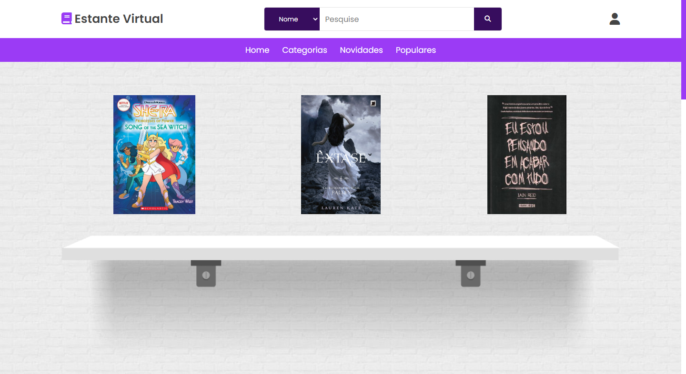
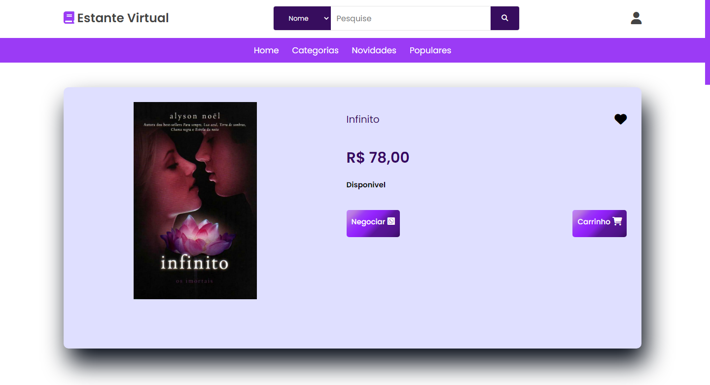

# Livraria **Estante Virtual**

Em 2022, desenvolvi uma aplicação web denominada "Estante Virtual" para auxiliar na venda de livros, incentivando a leitura e facilitando o acesso a títulos literários. Esse sistema foi desenvolvido na disciplina de Projeto Integrador do meu Curso Técnico Integrado de Informática. A aplicação foi publicada e apresentada na 10 edição da Mostra Científica, Cultural e Tecnológica do Instituto Federal de Educação, Ciência e Tecnologia de São Paulo - Campus Presidente Epitácio.
#
## **Tecnologias Utilizadas:**
- ### PHP;
- ### MySQL;
- ### HTML/CSS;
- ### JavaScript;
- ### Bootstrap.
#
## **Funcionalidades Principais:**
### Gerenciamento de Vendas:
- O administrador pode verificar o pagamento de vendas, atualizar o status, editar ou excluir vendas. Os itens de informação incluem status (solicitada, pagamento confirmado).
### Efetuação de Compras:
- Os leitores podem negociar a venda de livros diretamente com o administrador via WhatsApp. Os itens de informação incluem identificação do usuário, identificação dos títulos e detalhes de pagamento.
### Manutenção de Usuários:
- Cadastro, alteração e exclusão de dados de usuários, como nome, e-mail, endereço, telefone e tipo (leitor ou administrador).
### Comentários e Favoritos:
- Usuários podem adicionar, visualizar, alterar e excluir comentários sobre os títulos disponíveis, além de favoritar os livros que gostaram.
### Gestão de Títulos, Categorias, Fornecedores, Editoras e Autores:
- Manutenção de dados sobre os livros, suas categorias, fornecedores, editoras e autores, incluindo informações detalhadas como título, autor, editora, descrição, preço, estoque e quantidade de páginas.
### Relatórios:
- Geração de relatórios de todas as vendas, títulos por categoria, usuários cadastrados, compras realizadas e livros mais novos e mais vendidos.
## Níveis de Acesso:
### Administrador:
- Gerencia dados dos títulos, fornecedores, editoras, autores e usuários.
- Controla as vendas e a quantidade de livros em estoque.
### Leitor:
- Visualiza, comenta e favorita títulos.
- Realiza compras e acessa informações de sua conta.
#

## **Interfase Gráfica**
- ### Home

- ### Seção Novidades

- ### Seção Livros Relacionados

- ### Página do Livro

- ### Dashboard

- ### Minhas Compras

#
